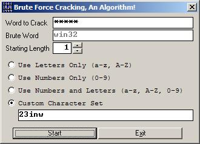

## Brute Force Word Generation Algorithm \(The real approach\)

### Description

This application sez what it does, i made it in Win32 Assembly back in 1998 for use in Game Crackings; and been using the same algo for years until i seen a lot of submissions in PSC about Brute-Forcing word generations, but those authors doesn't know what is a real fast Brute-Force Algo is? a friend of mine and i converted the Win32 Assembly Algo to Visual Basic (inspite of its limitations) and this was the result; hope you enjoy it and you find its usage? anyway, please leave vote or comment!
 
### More Info
 

             |
---                |---
**Submitted On**   |2002-03-23 23:35:50
**By**             |[Chris Vega](https://github.com/Planet-Source-Code/PSCIndex/blob/master/ByAuthor/chris-vega.md)
**Level**          |Advanced
**User Rating**    |4.7 (42 globes from 9 users)
**Compatibility**  |VB 5\.0, VB 6\.0
**Category**       |[Encryption](https://github.com/Planet-Source-Code/PSCIndex/blob/master/ByCategory/encryption__1-48.md)
**World**          |[Visual Basic](https://github.com/Planet-Source-Code/PSCIndex/blob/master/ByWorld/visual-basic.md)
**Archive File**   |[Brute\_Forc647773232002\.zip](https://github.com/Planet-Source-Code/chris-vega-brute-force-word-generation-algorithm-the-real-approach__1-32816/archive/master.zip)

